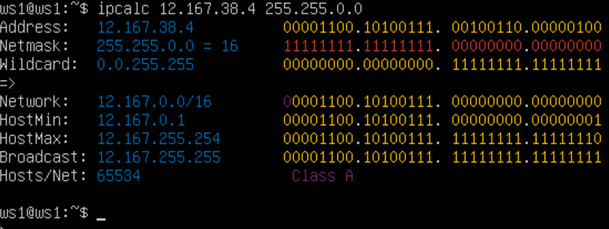
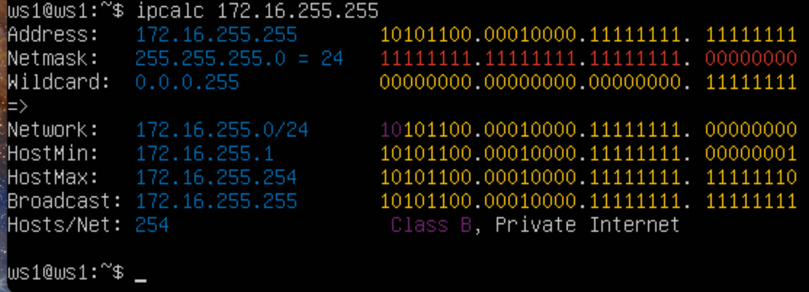
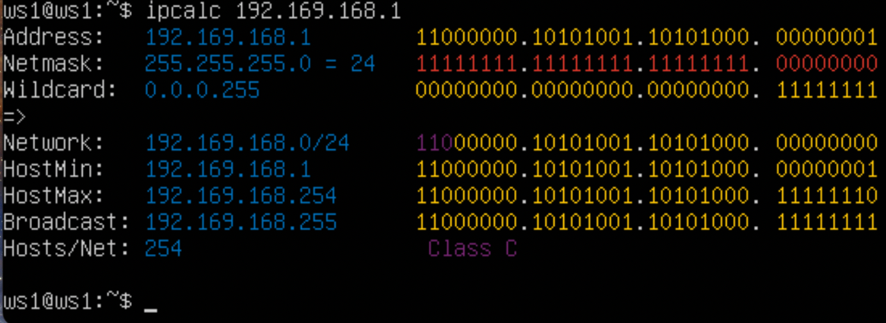
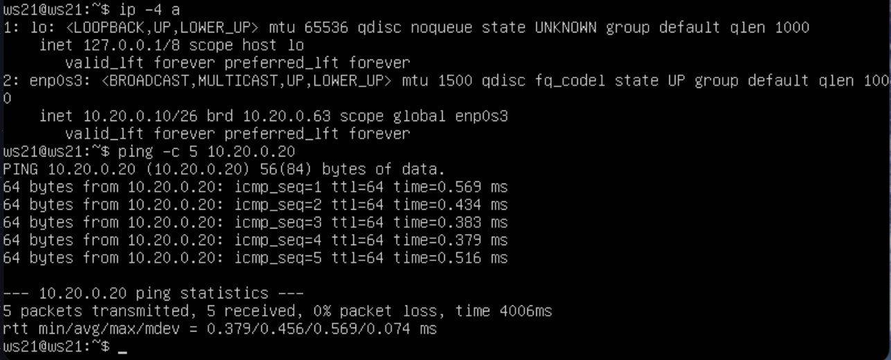

# Сети в Linux

Настройка сетей в Linux на виртуальных машинах.

## Contents

1. [Инструмент ipcalc](#part-1-инструмент-ipcalc)
2. [Статическая маршрутизация между двумя машинами](#part-2-статическая-маршрутизация-между-двумя-машинами)
3. [Утилита iperf3](#part-3-утилита-iperf3)
4. [Сетевой экран](#part-4-сетевой-экран)
5. [Статическая маршрутизация сети](#part-5-статическая-маршрутизация-сети)
6. [Динамическая настройка IP с помощью DHCP](#part-6-динамическая-настройка-ip-с-помощью-dhcp)
7. [NAT](#part-7-nat)
8. [Допополнительно. Знакомство с SSH Tunnels](#part-8-дополнительно-знакомство-с-ssh-tunnels)

## Part 1. Инструмент ipcalc

> ipcalc является утилитой командной строки, предназначенной для расчета подсети IPv4 или IPv6. Она позволяет анализировать IP-адреса, сетевые маски и другие параметры сети, а также выводить информацию о подсетях.

установить утилиту ipcalc
    
```c
$ sudo apt-get install ipcalc
```

### 1.1. Сетки и маски
Определите и посчитайте в отчете:

### 1) Адрес сети 192.167.38.54/13
Ответ: - 192.160.0.0/13

>Сетевой адрес — это идентификатор устройства, работающего в компьютерной сети

### 2) Перевод маски 255.255.255.0 в префиксную и двоичную запись,/15 в обычную и двоичную,11111111.11111111.11111111.11110000 в обычную и префиксную: 
 
> Префикс. Сокращенное обозначение формата маски подсети, в котором используется только количество битов 1 в маске.
 Пишется после слэша.
### Маска 255.255.255
255.255.255.0 префиксная - /24
Двоичная запись маски 255.255.255.0 в поле Netmask:11111111.11111111.11111111.00000000


### Маска 15
/15 при обычной записи в поле Маска сети: 255.254.0.0
/15 в двоичной записи также в поле Маска сети: 1111111.11111110.00000000.00000000
    

### Маска 11111111.11111111.11111111.11110000
>Команда ipcalc не принимает маски в двоичной записи, поэтому переводим оригинальный мак
11111111.11111111.11111111.11110000 в обычную запись и получим 255.255.255.240

В обычной форме: 255.255.255.240.
В виде префикса: /28
    
 

### 3) Минимальный и максимальный хост в сети 12.167.38.4 при масках: /8, 11111111.11111111.00000000.00000000, 255.255.254.0 и /4:

### Маска /8
Минимальный сетевой хост: 12.0.0.1.
Максимальный сетевой хост: 12.255.255.254


     
### Маска 11111111.11111111.00000000.00000000 

Минимальный сетевой хост: 12.167.0.1.
Максимальный сетевой хост: 12.167.255.254



### Маска 255.255.254.0

Минимальный сетевой хост: 12.167.38.1.
Максимальный сетевой хост: 12.167.39.254


### Маска /4 

Минимальный сетевой хост: 0.0.0.1
Максимальный сетевой хост: 15.255.255.254


### 1.2 localhost
>localhost - это стандартное сетевое имя, которое используется для ссылки на собственный компьютер или локальный хост.

### Определить и записать в отчёт, можно ли обратиться к приложению, работающему на localhost, со следующими IP: 194.34.23.100, 127.0.0.2, 127.1.0.1, 128.0.0.1

IP: 194.34.23.100

        
IP: 127.0.0.2

        
IP: 127.1.0.1

        
IP: 128.0.0.1


Loopback позволяет компьютеру взаимодействовать с самим собой, используя протоколы соединения.

>localhost — это имя хоста, обозначающее текущее устройство, используемое для доступа к нему. Он используется для доступа к сетевым службам, работающим на хосте, через
петлевой интерфейс. Сетевые стандарты IPv4 резервируют весь блок адресов 127.0.0.0/8 (более 16 миллионов адресов) для целей обратной связи.
То есть вы можете получить доступ к приложению, работающему на локальном хосте, только с IP-адресов в диапазоне 127.0.0.0/8. Это означает, что:

- можно: 127.0.0.2, 127.1.0.1

- нельзя: 194.34.23.100, 128.0.0.1

### 1.3 Диапазоны и сегменты сети

### 1) какие из перечисленных IP можно использовать в качестве публичного, а какие только в качестве частных: 10.0.0.45, 134.43.0.2, 192.168.4.2, 172.20.250.4, 172.0.2.1, 192.172.0.1, 172.68.0.2, 172.16.255.255, 10.10.10.10, 192.169.168.1

>Все IP-адреса протокола IPv4 делятся на публичные/глобальные/внешние (их называют «белыми») – они используются в Интернете, и частные/внешние.
локальные/внутренние (их называют «серыми») — используются в локальной сети.

>Частные серые адреса включают IP-адреса из следующих подсетей: от 10.0.0.0 до 10.255.255.255 с маской 255.0.0.0 или /8 от 172.16.0.0 до
172.31.255.255 с маской 255.240.0.0 или /12 от 192.168.0.0 до 192.168.255.255 с маской 255.255.0.0 или /16 От 100.64.0.0 до
100.127.255.255 с маской подсети 255.192.0.0 или /10.

>Это зарезервированные IP-адреса. Такие адреса предназначены для использования в закрытых локальных сетях, распространение таких адресов не контролируется.
кем угодно.
    
### Частный
     
IP: 10.0.0.45

       
IP: 192.168.4.2
 
       
IP: 172.20.250.4
 
       
IP: 172.16.255.255
 
       
IP: 10.10.10.10        


### Публичный

IP 192.169.168.1 
       

IP: 134.43.0.2
 
       
IP: 172.0.2.1
 
       
IP: 192.172.0.1 

       
IP: 172.68.0.2

 
### 2) Какие из перечисленных IP адресов шлюза возможны у сети 10.10.0.0/18: 10.0.0.1, 10.10.0.2, 10.10.10.10, 10.10.100.1, 10.10.1.255


>Сеть 10.10.0.0/18 имеет диапазон IP-адресов от 10.10.0.0 до 10.10.63.255. Шлюз обычно находится в этом диапазоне адресов, поэтому с указанного IP-адреса
адреса

### Невозможно
        
- IP: 10.10.100.1

- IP: 10.0.0.1

### Возможно
     
- IP: 10.10.0.2
     
- ИП: 10.10.10.10
     
- IP: 10.10.1.255


## Part 2. Статическая маршрутизация между двумя машинами

### Поднять две виртуальные машины (далее -- ws1 и ws2)

### С помощью команды ip a посмотреть существующие сетевые интерфейсы

Для ws1


Для ws2


### Описать сетевой интерфейс, соответствующий внутренней сети на обеих машинах и установите следующие адреса и маски: ws1 — 192.168.100.10, маска /16, ws2 — 172.24.116.8, маска /12

содержимое измененного файла etc/netplan/00-installer-config.yaml для ws1


содержимое измененного файла etc/netplan/00-installer-config.yaml для ws2


### Выполнить команду netplan apply для перезапуска сервиса сети

Для ws1


Для ws2


### Сетевые интерфейсы после выполнения команды:

Для ws1


Для ws2


### 2.1. Добавление статического маршрута вручную

### Добавить статический маршрут от одной машины до другой и обратно при помощи команды вида ip r add

Для ws1


Для ws2


### Пропинговать соединение между машинами

Для ws1


Для ws2


### 2.2. Добавление статического маршрута с сохранением

- Перезапустить машины
```c
$ sudo restart
```
### Добавить статический маршрут от одной машины до другой с помощью файла 
etc/netplan/00-installer-config.yaml

Убедитесь, что статические маршруты были удалены после перезапуска.
Для ws1


Для ws2


### Добавьте статический маршрут от одной машины к другой, используя
  Файл theetc/netplan/00-installer-config.yaml
  
Добавьте статические маршруты, используя файл etc/netplan/00-installer-config.yaml.

Для ws1


Для ws2


### Убедитесь, что изменения в файле сохранены, и примените новую конфигурацию с помощью 
```c
$ sudo netplan apply
```
### Убедитесь, что маршруты добавлены.
```c
$ ip r
```
Для ws1


Для ws2


### Пропинговать соединение между машинами

Для ws1


Для ws2


## Part 3. Утилита Iperf3

- В этой задаче используются виртуальные машины ws1 и ws2 из части 2.

### 3.1 Скорость соединения

### Перевести и записать в отчёт: 8 Mbps в MB/s, 100 MB/s в Kbps, 1 Gbps в Mbps

- Перевод
8 Мбит/с 1 МБ/с 1 МБ = 8 МБ
100 МБ/с 800000 Кбит/с 1 МБ = 8 * 10^3 Кб
1 Гбит/с 1000 Мбит/с 1 Гбит = 10^3 МБ
    
### 3.2 Утилита Iperf3

>Консольная утилита iperf3 предназначена для измерения пропускной способности сети. Он поддерживает протоколы TCP и UDP. Для тестирования вам необходимо запустить iperf3 как на сервере, так и на клиенте. Клиентская часть будет генерировать трафик, а серверная — принимать и отбрасывать.

### Измерьте скорость соединения между ws1 и ws2

Сначала необходимо запустить серверную часть программы. Для этого запустите на ws1 iperf3 -s. Таким образом сервер был запущен с адресом 192.168.100.10.


Подключитесь к серверу с помощью iperf3 -c 192.168.100.10 и получите информацию о скорости соединения.


- Скорость передачи для отправителя (ws1): 4,70 Гбит/с.
- Скорость передачи данных получателя (ws2): 4,70 Гбит/с.

## Part 4. Сетевой межсетевой экран

>Брандмауэр — это своего рода управляемый барьер или шлюз, который контролирует разрешенную и запрещенную веб-активность в частной сети.

— В этой задаче используются виртуальные машины ws1 и ws2 из части 2.

### 4.1 Утилита Iptables

>Iptables — это программа брандмауэра командной строки, которая разрешает или блокирует трафик в зависимости от используемой цепочки политик. Iptables использует пакетный подход для мониторинга трафика. Когда программа пытается подключиться к вашей системе, iptables ищет правило из предопределенного списка. Если правило не найдено, оно возвращается к действию по умолчанию и запрещает доступ к новому соединению.
Используемые флаги:
-A добавляет правило;
-p выбор протокола;
--dport выбор порта;
-j выбор действия (ПРИНЯТЬ/ОТКЛОНИТЬ/УДАЛИТЬ);
Так как нам нужно заблокировать пинг, а эта утилита работает по протоколу icmp, то я прописываю icmp с флагом -p

Создать файл /etc/firewall.sh, имитирующий фаерволл, на ws1 и ws2:
```c
#!/bin/sh

# Удаление всех правил в таблице "filter" (по-умолчанию).
iptables –F
iptables -X
```
Нужно добавить в файл подряд следующие правила:

1) на ws1 применить стратегию когда в начале пишется запрещающее правило, а в конце пишется разрешающее правило (это касается пунктов 4 и 5)

2) на ws2 применить стратегию когда в начале пишется разрешающее правило, а в конце пишется запрещающее правило (это касается пунктов 4 и 5)

3) открыть на машинах доступ для порта 22 (ssh) и порта 80 (http)

4) запретить echo reply (машина не должна "пинговаться”, т.е. должна быть блокировка на OUTPUT)

5) разрешить echo reply (машина должна "пинговаться")

Для ws1


Для ws2


### Запустить файлы на обеих машинах командами chmod +x /etc/firewall.sh и /etc/firewall.sh

Для ws1


Для ws2


### Описание стратегий, используемых в первом и втором файлах.

>При обработке правил сверху вниз при совпадении описанных условий применяется правило, расположенное выше.
Поскольку правило запрета выше правила разрешения в файле ws1, виртуальная машина 1 не может выполнить проверку связи с виртуальной машиной 2.
Для виртуальной машины 2 ситуация обратная, поскольку правило разрешения выше правила запрета.
    
### 4.2 Утилита Nmap

### Командой ping найти машину, которая не "пингуется", после чего утилитой nmap показать, что хост машины запущен
Проверка: в выводе nmap должно быть сказано: Host is up

Для ws1


Для ws2


- Команда Nmap:

>Nmap — это инструмент командной строки Linux для исследования сети и аудита безопасности. Одной из особенностей nmap является то, что эта утилита может определить, работает ли хост, даже если его невозможно проверить.

Для ws1


Для ws2


## Part 5. Статическая сетевая маршрутизация

- Поднять пять виртуальных машин (3 рабочие станции (ws11, ws21, ws22) и 2 роутера (r1, r2))

### 5.1 Настройка адресов машин

### Настроить конфигурации машин в etc/netplan/00-installer-config.yaml согласно сети на рисунке.


- Изменение конфигурации рабочьих станций

Для ws11


Для ws21


Для ws22


- Изменение конфигурации роутеров

Для r1


Для r1


### Перезапустить сервис сети. Если ошибок нет, то командой ip -4 a проверить, что адрес машины задан верно. Также пропинговать ws22 с ws21. Аналогично пропинговать r1 с ws11.

Команд ip -4a для ws22:


Команд ip -4a для ws21 и пинг с ws22:


Команда ip -4a ws11:


Команда ip -4a,r1 и пинг с ws11:


Команда ip -4a r2


### 5.2 Включение IP-переадресации

### Для включения переадресации IP, выполните команду на роутерах:
- sysctl -w net.ipv4.ip_forward=1
При таком подходе переадресация не будет работать после перезагрузки системы.

### Откройте файл /etc/sysctl.conf и добавьте в него следующую строку:
- net.ipv4.ip_forward = 1 
При использовании этого подхода, IP-переадресация включена на постоянной основе. 
 
>ip_forward - это параметр или функция в компьютерных сетях, которая определяет, разрешено ли пересылать пакеты данных между различными сетевыми интерфейсами в операционной системе. Когда ip_forward включено, компьютер может принимать сетевые пакеты и пересылать их через другие интерфейсы, чтобы доставить их к назначению. Это функциональность, которая играет важную роль в маршрутизации пакетов в сетях. 

Команда sysctl -w net.ipv4.ip_forward=2 для r1:


Команда sysctl -w net.ipv4.ip_forward=1 для r1:


Файл /etc/sysctl.conf для r1:


Файл /etc/sysctl.conf для r2:


### 5.3 Конфигурация маршрута по умолчанию

- Вот пример вывода команды `ip r' после добавления шлюза:
 ```c
  default 10.10.0.1 dev eth0
 10.10.0.0/18 dev eth0 ссылка на область действия ядра proto 10.10.0.2
```
### Настройте маршрут по умолчанию (шлюз) для рабочих станций. Для этого добавьте значение по умолчанию перед IP-адресом маршрутизатора в файле конфигурации.

Для ws11


Для ws21


Для ws22


### Вызвать ip r и показать, что добавился маршрут в таблицу маршрутизации

Для ws11


Для ws21


Для ws22


### Пропинговать с ws11 роутер r2 и показать на r2, что пинг доходит. Для этого использовать команду:
 ```c
tcpdump -tn -i eth1
 ```
Для ws11


Для r2


### 5.4 Добавление статических маршрутов

### Добавить в роутеры r1 и r2 статические маршруты в файле конфигураций. Пример для r1 маршрута в сетку 10.20.0.0/26:
 ```c
 ### Добавьте описание в конец сетевого интерфейса eth1:
 - to: 10.20.0.0
   via: 10.100.0.12
  ``` 
- В отчёт поместить скрины с содержанием изменённого файла etc/netplan/00-installer-config.yaml для каждого роутера.
 
- Для r1


- Для r2


### Вызвать ip r и показать таблицы с маршрутами на обоих роутерах. Пример таблицы на r1:
 ```c
   10.100.0.0/16 dev eth1 proto kernel scope link src 10.100.0.11
   10.20.0.0/26 via 10.100.0.12 dev eth1
   10.10.0.0/18 dev eth0 proto kernel scope link src 10.10.0.1
 ``` 
Для r1


Для r2


### Запустить команды на ws11:
 ```c
ip r list 10.10.0.0/[маска сети] и ip r list 0.0.0.0/0
 ```
- Для 10.10.0.0/[сетевая маска]


- Для 0.0.0.0/0


> Маршрут по умолчанию имеет более низкий приоритет и активируется, когда в таблице маршрутизации не найден соответствующий маршрут. Для сети 10.10.0.0 создано правило и соответственно используется созданный маршрут.

### 5.5 Построение списка маршрутизаторов

Пример вывода утилиты traceroute после добавления шлюза:
 ```c
    1 10.10.0.1 0 ms 1 ms 0 ms
    2 10.100.0.12 1 ms 0 ms 1 ms
    3 10.20.0.10 12 ms 1 ms 3 ms
  ```   
### Запустить на r1 команду дампа:
 ```c
tcpdump -tnv -i eth0
 ```


### При помощи утилиты traceroute построить список маршрутизаторов на пути от ws11 до ws21

- В отчёте, опираясь на вывод, полученный из дампа на r1, объяснить принцип работы построения пути при помощи traceroute.


Как работает трассировка:
>Утилита отправляет на целевой узел несколько пакетов со временем жизни (TTL, time to live — количество прыжков, которое может сделать пакет, прежде чем исчезнет). Следующий маршрутизатор получает пакеты и отправляет сообщение о том, что срок действия пакетов истек. Traceroute фиксирует адрес этого маршрутизатора и отправляет следующие пакеты, уже с TTL 2. Итак, каждый раз увеличивая TTL на 1, трассировка строит список маршрутизаторов, через которые пакеты прошли до целевого хоста.
    
### 5.6 Использование протокола ICMP при маршрутизации

### Пропинговать с ws11 несуществующий IP (например, 10.30.0.111) с помощью команды:
 ```c
ping -c 1 10.30.0.111
 ```
Пинг несуществующего айпи с ws11:


### Запустить на r1 перехват сетевого трафика, проходящего через eth0 с помощью команды:
 ```c
tcpdump -n -i eth0 icmp
 ```
Результат перехвата трафика на r1:


## Part 6. Динамическая настройка IP с помощью DHCP

### Для r2 настроить в файле /etc/dhcp/dhcpd.conf конфигурацию службы DHCP:

### 1) указать адрес маршрутизатора по-умолчанию, DNS-сервер и адрес внутренней сети.
Пример файла для r2:
 ```c
subnet 10.100.0.0 netmask 255.255.0.0 {}

subnet 10.20.0.0 netmask 255.255.255.192
{
    range 10.20.0.2 10.20.0.50;
    option routers 10.20.0.1;
    option domain-name-servers 10.20.0.1;
}
 ```


### 2) в файле resolv.conf прописать nameserver 8.8.8.8.


### Перезагрузить службу DHCP командой systemctl restart isc-dhcp-server.


### Машину ws21 перезагрузить при помощи reboot и через ip a показать, что она получила адрес.

 
### Пропинговать ws21 с ws22.


### Указать MAC адрес у ws11, для этого в etc/netplan/00-installer-config.yaml надо добавить строки: macaddress: 10:10:10:10:10:BA, dhcp4: true


### Для r1 настроить аналогично r2, но сделать выдачу адресов с жесткой привязкой к MAC-адресу (ws11). Провести аналогичные тесты


### Запросить с ws21 обновление ip адреса до


### Запросить с ws21 обновление ip адреса после

 


В отчёте описать, какими опциями DHCP сервера пользовались в данном пункте.

- Команда для смены присвоенного ip - dhclient, утилита для управления адресом интерфейса по протоколу DHCP.
- sudo dhclient enp0s8 - обновляет все параметры, запрашивая их у DHCP сервера

## Part 7. NAT

> NAT (Network Address Translation) - это технология, используемая в компьютерных сетях для перевода IP-адресов и портов пакетов данных, проходящих через граничные точки сети. Она позволяет использовать один публичный IP-адрес для коммуникации с внешней сетью для нескольких устройств внутри локальной сети.
При использовании NAT приватные IP-адреса в локальной сети заменяются на публичный IP-адрес граничного маршрутизатора (обычно используется NAT-маршрутизатор). Это обеспечивает дополнительный уровень безопасности и консервации IPv4-адресов, поскольку используется меньше публичных IP-адресов.
NAT также выполняет функцию обеспечения перевода портов, позволяя различным устройствам в локальной сети использовать один и тот же публичный IP-адрес с разными портами для установления соединения с внешней сетью. Это достигается сопоставлением портов IP-адресов локальных устройств с портами публичного IP-адреса.

- В данном задании используются виртуальные машины из Части 5

### В файле /etc/apache2/ports.conf на ws22 и r1 изменить строку Listen 80 на Listen 0.0.0.0:80, то есть сделать сервер Apache2 общедоступным

Для ws22


Для r2


### Запустить веб-сервер Apache командой service apache2 start на ws22 и r1

Для ws22


Для r2


### Добавить в фаервол, созданный по аналогии с фаерволом из Части 4, на r2 следующие правила:
- 1) удаление правил в таблице filter - iptables -F
- 2) удаление правил в таблице "NAT" - iptables -F -t nat
- 3) отбрасывать все маршрутизируемые пакеты - iptables --policy FORWARD DROP


Запускать файл также, как в Части 4


### Проверить соединение между ws22 и r1 командой ping

- При запуске файла с этими правилами, ws22 не должна "пинговаться" с r1


### Добавить в файл ещё одно правило:

- 4) разрешить маршрутизацию всех пакетов протокола ICMP


### Проверить соединение между ws22 и r1 командой ping

При запуске файла с этими правилами, ws22 должна "пинговаться" с r1


### Добавить в файл ещё два правила:

- 5) включить SNAT, а именно маскирование всех локальных ip из локальной сети, находящейся за r2 (по обозначениям из Части 5 - сеть 10.20.0.0)
Совет: стоит подумать о маршрутизации внутренних пакетов, а также внешних пакетов с установленным соединением

> SNAT - Source Network Address Translation - изменение адреса и порта источника пакета, доступен в цепочке POSTROUTING

- 6) включить DNAT на 8080 порт машины r2 и добавить к веб-серверу Apache, запущенному на ws22, доступ извне сети
Совет: стоит учесть, что при попытке подключения возникнет новое tcp-соединение, предназначенное ws22 и 80 порту

> DNAT - Destination Network Address Translation - изменение адреса и порта назначения пакета, доступен в цепочках PREROUTING и OUTPUT
Более подробное знакомство мы начнем со SNAT, как мы уже говорили выше данное действие изменяет адрес и порт источника пакета, одно из основных практический применений - обеспечения доступа локальной сети в интернет. Давайте посмотрим, в чем состоит проблема и как SNAT помогает ее решить. Для использования в локальных сетях используются диапазоны частных или т.н. "серых" IP-адресов, их особенностью является то, что они не маршрутизируются в интернете, т.е. если маршрутизатору попадает такой пакет и для него нет отдельного маршрута - он будет отброшен. При этом внешний адрес у данной сети один и его как-то следует использовать для обращения к внешнему миру всех локальных ПК.
Что делает SNAT? Он заменяет адрес источника пакета внешним адресом, также, при необходимости, меняет и порт источника, что позволяет различать запросы, сделанные с одного и того же порта разных ПК, запись о выполненной трансляции заносится в специальную таблицу трансляций (она же таблица NAT). Получив ответ роутер находит запись в таблице трансляций и на ее основании изменяет адрес и порт назначения ответного пакета, после чего он прозрачно доставляется адресату в локальной сети.
Второе основное действие в таблице nat - это DNAT - или изменения адреса и порта назначения пакета. Это действие применимо в цепочках PREROUTING и OUTPUT, т.е. на самом входе в брандмауэр, раньше таблицы nat пакеты попадают только в mangle. На практике DNAT применяется в основном для проброса портов


- Перед тестированием рекомендуется отключить сетевой интерфейс NAT (его наличие можно 
проверить командой ip a) в VirtualBox, если он включен.

### Проверить соединение по TCP для SNAT, для этого с ws22 подключиться к серверу Apache на 
r1 командой: telnet [адрес] [порт].


### Проверить соединение по TCP для DNAT, для этого с r1 подключиться к серверу Apache на 
ws22 командой telnet (обращаться по адресу r2 и порту 8080)


## Part 8. Дополнительно. Знакомство с SSH Tunnels

- В данном задании используются виртуальные машины из Части 5' 

### Запустить на r2 фаервол с правилами из Части 7


### Запустить веб-сервер Apache на ws22 только на localhost (то есть в файле /etc/apache2/ports.conf изменить строку Listen 80 на Listen localhost:80)


### Воспользоваться Local TCP forwarding с ws21 до ws22, чтобы получить доступ к веб-серверу на ws22 с ws21


> На машине ws21 по порту 9999 подключаемся к apache2 серверу (работает на 80 порте) на ws22, который расположен по адресу 10.20.0.20 на учётке ws22. По итогу имеем доступ к машине ws22 под учёткой ws22.

> Другое объяснение: После успешного подключения к SSH-серверу на «ws22», на «ws21» SSH-клиент начинает слушать порт 9999. При подключении к порту 9999 на «ws21», SSH-сервер на «ws22» устанавливает соединение с localhost (коим и является для себя самого «ws22») на порт 80 и передает по этому соединению данные, принятые ssh-клиентом на «ws1» на порт 9999.

### Для проверки, сработало ли подключение , перейдите во второй терминал (например, клавишами Alt + F2) и выполните команду:
telnet 127.0.0.1 [локальный порт]


### Воспользоваться Remote TCP forwarding c ws11 до ws22, чтобы получить доступ к веб-серверу на ws22 с ws11


Проверяем telnet 127.0.0.1 [локальный порт]


